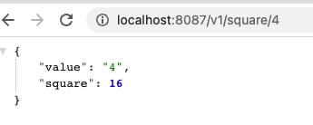

```bash
> sraza @ sraza0522mac ~/code/devops_educative/docker/05_nodejs 22:21:58
$ docker build -t rsaim/05_nodejs .
[+] Building 0.5s (12/12) FINISHED                                                                                                            
 => [internal] load build definition from Dockerfile                                0s
 => => transferring dockerfile: 37B                                                 0s
 => [internal] load .dockerignore                                                   0s
 => => transferring context: 2B                                                     0s
 => [internal] load metadata for docker.io/library/node:10-alpine                   3s
 => [1/7] FROM docker.io/library/node:10-alpine@sha256:dc98dac24efd4254f75976c40bce46944697a110d06ce7fa47e7268470cf2e28                  0.0s
 => [internal] load build context                                                   0s
 => => transferring context: 267B                                                   0s
 => CACHED [2/7] RUN mkdir -p /usr/src/app                                          0s
 => CACHED [3/7] WORKDIR /usr/src/app                                               0s
 => CACHED [4/7] COPY package.json /usr/src/app                                     0s
 => CACHED [5/7] RUN npm install                                                    0s
 => CACHED [6/7] WORKDIR /usr/src/app                                               0s
 => [7/7] COPY . /usr/src/app                                                       0s
 => exporting to image                                                              0s
 => => exporting layers                                                             0s
 => => writing image sha256:3a1d8193c84fe81515bb290d9d03394e7a48cd46eb483fe85f19e1f5d6c3eeef                                             0.0s
 => => naming to docker.io/rsaim/05_nodejs                                          0s

Use 'docker scan' to run Snyk tests against images to find vulnerabilities and learn how to fix them
```

```bash
> sraza @ sraza0522mac ~/code/devops_educative/docker/05_nodejs 22:22:01
$ docker run --rm -it -p 8087:80 rsaim/05_nodejs

> node-server@1.0.0 start /usr/src/app
> node index.js

Listening on http://localhost:80    
```



